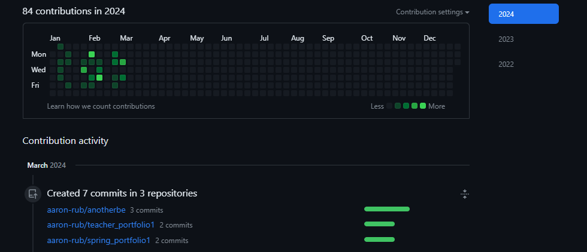
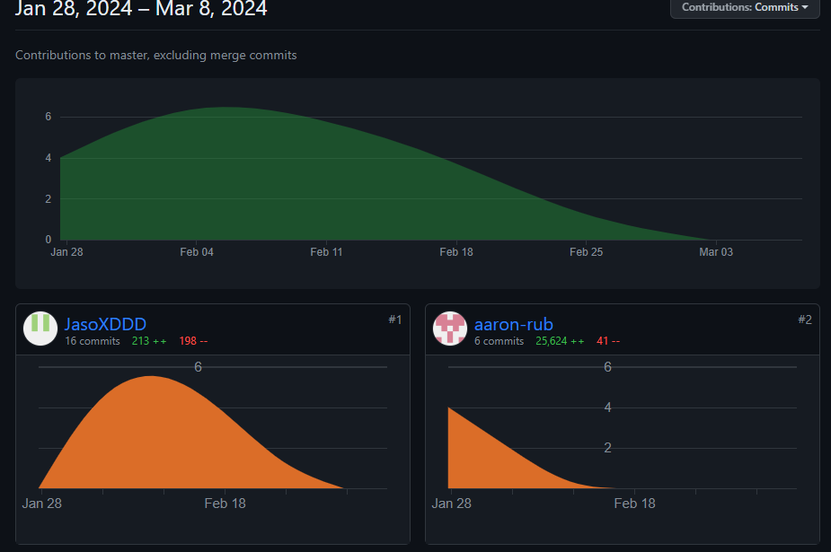
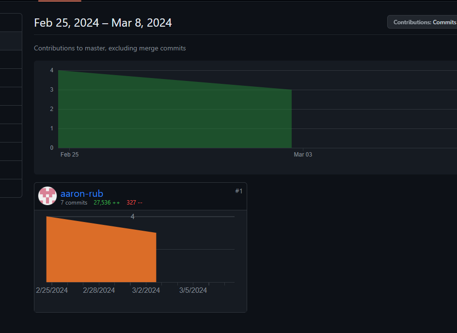
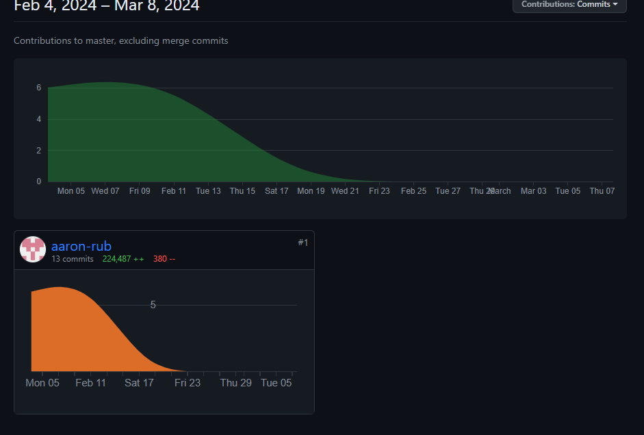

# Individual seed review

## Github analytics

### Github pages blog
- 

### AP work
- 
- 
- 
- 

### Group contributions

## Team collaboration
I feel as if in my past tri's that I was not very outgoing and reaching out to others, a big part of that was that I would always rely on the same group over and over. This prevented my own personal growth and learning, this tri I had decided to try something new and collaborate with newer bigger groups. I am participating in group meetings  starting to get highly organized.