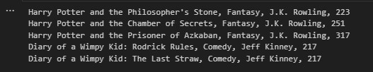

## 5.1 & 5.2 Hacks
`Popcorn Hack`: Which of the following lines will cause an error?
```java
public class SnackDriver {
    public static void main(String[] args) {
        Snack choiceOne = new Snack("cookies", 100);
        Snack choiceTwo = new Snack();
        System.out.println(choiceOne.getName());
        System.out.println(choiceOne.getCalories());
        choiceTwo.setName("chips");
        choiceTwo.calories = 150;
    }
}
```
choiceTwo.calories = 150; should give an error. This is because you’re trying to access the calories field of the Snack object directly. If calories is a private field in the Snack class, you won’t be able to access it directly from outside the class.

<h3>Hacks </h3>

Create a Book class where each book has a title, genre, author, and number of pages. Include a default and overloaded constructor.

```java
public class Book {
    private String title;
    private String genre;
    private String author;
    private int numberOfPages;

    // Default constructor
    public Book() {
        this.title = "";
        this.genre = "";
        this.author = "";
        this.numberOfPages = 0;
    }

    // Overloaded constructor
    public Book(String title, String genre, String author, int numberOfPages) {
        this.title = title;
        this.genre = genre;
        this.author = author;
        this.numberOfPages = numberOfPages;
    }

    // Getter methods 
    public String getTitle() {
        return title;
    }

    public String getGenre() {
        return genre;
    }

    public String getAuthor() {
        return author;
    }

    public int getNumberOfPages() {
        return numberOfPages;
    }

    // Setter methods 
    public void setTitle(String title) {
        this.title = title;
    }

    public void setGenre(String genre) {
        this.genre = genre;
    }

    public void setAuthor(String author) {
        this.author = author;
    }

    public void setNumberOfPages(int numberOfPages) {
        this.numberOfPages = numberOfPages;
    }
}

public class Main {
    public static void main(String[] args) {
        Book book1 = new Book("Harry Potter and the Philosopher's Stone", "Fantasy", "J.K. Rowling", 223);
        Book book2 = new Book("Harry Potter and the Chamber of Secrets", "Fantasy", "J.K. Rowling", 251);
        Book book3 = new Book("Harry Potter and the Prisoner of Azkaban", "Fantasy", "J.K. Rowling", 317);
        Book book4 = new Book("Diary of a Wimpy Kid: Rodrick Rules", "Comedy", "Jeff Kinney", 217);
        Book book5 = new Book("Diary of a Wimpy Kid: The Last Straw", "Comedy", "Jeff Kinney", 217);

        System.out.println(book1.getTitle() + ", " + book1.getGenre() + ", " + book1.getAuthor() + ", " + book1.getNumberOfPages());
        System.out.println(book2.getTitle() + ", " + book2.getGenre() + ", " + book2.getAuthor() + ", " + book2.getNumberOfPages());
        System.out.println(book3.getTitle() + ", " + book3.getGenre() + ", " + book3.getAuthor() + ", " + book3.getNumberOfPages());
        System.out.println(book4.getTitle() + ", " + book4.getGenre() + ", " + book4.getAuthor() + ", " + book4.getNumberOfPages());
        System.out.println(book5.getTitle() + ", " + book5.getGenre() + ", " + book5.getAuthor() + ", " + book5.getNumberOfPages());
    }
}
Main.main(null);
```


## 5.4 Hacks
 ### `POPCORN HACKS`: write an accessor method for each of the instance variables:
 ```java
 public class Course {
    private String name;
    private String gradeLevel;
    private int period;

    // Accessor method for 'name'
    public String getName() {
        return this.name;
    }

    // Accessor method for 'gradeLevel'
    public String getGradeLevel() {
        return this.gradeLevel;
    }

    // Accessor method for 'period'
    public int getPeriod() {
        return this.period;
    }
}
```

### 5.5 Hacks

Create a Java class BankAccount to represent a simple bank account. This class should have the following attributes:

- accountHolder (String): The name of the account holder.
balance (double): The current balance in the account.
Implement the following mutator (setter) methods for the BankAccount class:

- setAccountHolder(String name): Sets the name of the account holder.
- deposit(double amount): Deposits a given amount into the account.
- withdraw(double amount): Withdraws a given amount from the account, but only if the withdrawal amount is less than or equal to the current balance.

Ensure that the balance is never negative.

```java

public class BankAccount {
    private String accountHolder;
    private double balance;

    // Constructor
    public BankAccount(String accountHolder, double balance) {
        this.accountHolder = accountHolder;
        this.balance = balance;
    }

    // Setter for accountHolder
    public void setAccountHolder(String accountHolder) {
        this.accountHolder = accountHolder;
    }

    // Method to deposit an amount
    public void deposit(double amount) {
        if (amount > 0) {
            this.balance += amount;
        }
    }

    // Method to withdraw an amount
    public void withdraw(double amount) {
        if (amount > 0 && amount <= this.balance) {
            this.balance -= amount;
        }
    }

    // Getter for balance
    public double getBalance() {
        return this.balance;
    }
}

public class Main {
    public static void main(String[] args) {
        // Create a bank account for Alice with an initial balance of $1000
        BankAccount aliceAccount = new BankAccount("Alice", 1000.00);

        // Deposit $500 into Alice's account
        aliceAccount.deposit(500.00);

        // Create a bank account for Bob with an initial balance of $2000
        BankAccount bobAccount = new BankAccount("Bob", 2000.00);

        // Withdraw $300 from Bob's account
        bobAccount.withdraw(300.00);

        // Print the balances
        System.out.println("Alice's balance: " + aliceAccount.getBalance());
        System.out.println("Bob's balance: " + bobAccount.getBalance());
    }
}

Main.main(null);
```

### 5.6 Hacks

Create a Java class MathUtility with a set of utility methods for mathematical operations. Implement the following methods:

- calculateAverage(double[] numbers): Calculate the average of an array of numbers.
- isPrime(int number): Check if a given integer is prime.
- findFactors(int number): Find and return an array of factors for a given integer.
Include proper error handling for edge cases and invalid input.

```java
public class MathUtility {
    // Calculate the average of an array of numbers
    public static double calculateAverage(double[] numbers) {
        if (numbers == null || numbers.length == 0) {
            throw new IllegalArgumentException("Array must not be null or empty");
        }
        double sum = 0;
        for (double num : numbers) {
            sum += num;
        }
        return sum / numbers.length;
    }

    // Check if a given integer is prime
    public static boolean isPrime(int number) {
        if (number <= 1) {
            return false;
        }
        for (int i = 2; i < number; i++) {
            if (number % i == 0) {
                return false;
            }
        }
        return true;
    }

    // Find and return an array of factors for a given integer
    public static int[] findFactors(int number) {
        if (number <= 0) {
            throw new IllegalArgumentException("Number must be greater than 0");
        }
        int[] factors = new int[number];
        int count = 0;
        for (int i = 1; i <= number; i++) {
            if (number % i == 0) {
                factors[count] = i;
                count++;
            }
        }
        int[] result = new int[count];
        System.arraycopy(factors, 0, result, 0, count);
        return result;
    }
}

public class Main {
    public static void main(String[] args) {
        // Calculate the average of an array of numbers
        double[] numbers = {1.0, 2.0, 3.0, 4.0, 5.0};
        double average = MathUtility.calculateAverage(numbers);
        System.out.println("Average: " + average);

        // Check if a number is prime
        int number = 7;
        boolean isPrime = MathUtility.isPrime(number);
        System.out.println("Is " + number + " prime? " + isPrime);

        // Find and print the factors of a number
        number = 12;
        int[] factors = MathUtility.findFactors(number);
        System.out.print("Factors of " + number + ": ");
        for (int factor : factors) {
            System.out.print(factor + " ");
        }
    }
}

Main.main(null);
```


## 5.9 Hacks
### Local vs Instance

Make the code a little clearer by using the **this** keyword

b,a,w,and s aren't meaningful parameters change them into breed, age, weight, and score 

distinguish the local and instance variables using the **this** keyword

```java
public class Dog {
    private String breed;
    private int age;
    private double weight;
    private double score;

    public Dog(String breed, int age, double weight, double score){
        this.breed = breed;
        this.age = age;
        this.weight = weight;
        this.score = score;
    }
}
```
## 5.10 Hacks
