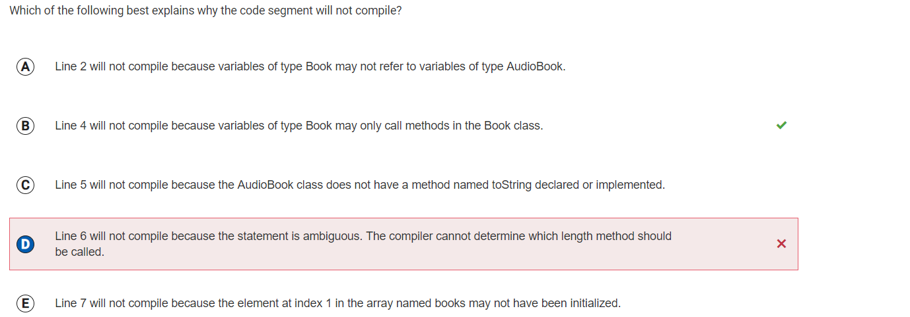
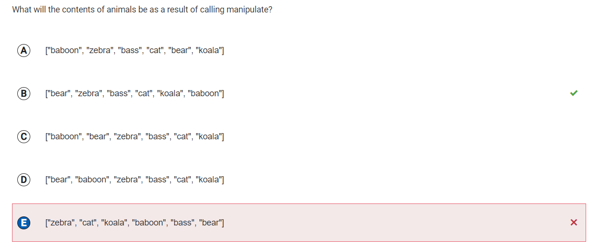
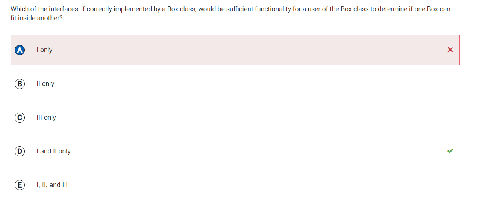
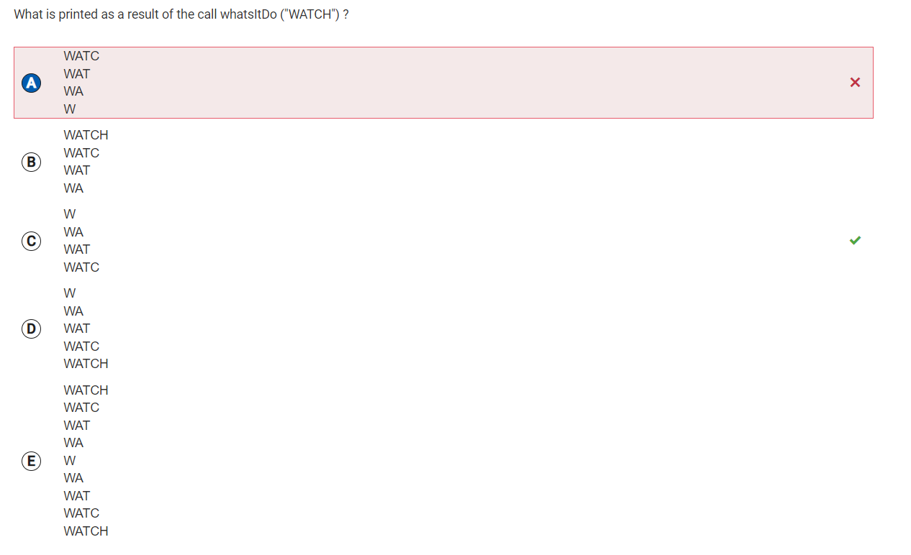

## Group Contribution


This trimester, my role was dev-ops. But since that role isn't that work intensive, I also took up backend work. Mostly working on small bugs with the player API, in the end I was not able to fix our PlayerAPI with the amount of bugs in the code and the repository itself. Originally, Haoxuan wrote the code in python because he didn't know that it had to be in java. So I spent my time trying to convert his code that used flask, to java code using spring. Ultimately, I think that me trying to just straight up convert the code was the reason I was not able to figure it out.

### Game System Overview
[Here](https://github.com/BobTheFarmer/VACTQ-Typing-Game/issues/12) is an overview of our project. Stuff I worked on/helped with is in white.

## Key Commits
- [Player api and Player Controller](https://github.com/BobTheFarmer/VACTQ-Backend4/commit/38e0c06bc00aae645a578e7e56209f10b99bdeb6)

## Player API 
I created a RESTful API using Spring Boot and Spring Data JPA. The `Player` class is an Entity class that I use to create the 'players' table in the database. Each instance of the `Player` class represents a row in the 'players' table. The `PlayerController` class is a RestController which exposes various endpoints to perform CRUD (Create, Read, Update, Delete) operations on the 'players' table.

I noticed some errors in the code:
- The `getUid()`, `getName()`, `getDistance()` methods in the `Player` class are returning `null`. They should return the respective class variables.
- The `setName(Object name2)` and `setDistance(Object distance2)` methods in the `Player` class are not setting the values of the respective class variables. They should set the values of the respective class variables.

From this exercise, I've learned how to handle HTTP requests and responses, and how to create, read, update, and delete records in a database using Spring. I've also learned about the importance of proper method implementation and usage of objects. I've become familiar with various Spring Boot annotations like `@Entity`, `@Table`, `@Id`, `@GeneratedValue`, `@Column`, `@RestController`, `@RequestMapping`, `@PostMapping`, `@GetMapping`, `@PutMapping`, `@DeleteMapping`.

### Use of OOP
```java
public class Player {
    @Column(name = "name", nullable = false)
    private String name;

    public String getName() {
        return name;
    }

    public void setName(String name) {
        this.name = name;
    }
}
```
In this code, the Player class encapsulates the name property. This property is declared as private, which means it can’t be accessed directly from outside the class. Instead, I’ve provided public getName() and setName() methods (known as getter and setter) to access and modify the name property. This is a key aspect of Encapsulation, providing control over how class data is accessed or modified.
------
### MC Corrections


Q22

Why I got it wrong: Methods of the superclass can be overridden in the subclass. Since the books array is declared of type Book, the compiler will check to see if Book has a length() method. Since Book has a length() method, there is not a compile time error. At run-time, the length() method in AudioBook will be executed since the object at books[0] is an AudioBook.

Q23

List is an interface, which an ArrayList implements. Please note that List is no longer tested as part of the AP CSA exam and ArrayList will be used instead. This would be the result if when words that started with “b” were found, they were added to the end instead of inserted at index animals.size() – k such as if the statement in the for loop was animals.add(animals.remove(k));.

Q25

 Choice II provides the user with methods smallerHeight, smallerWidth, and smallerDepth that let the user know if one box is smaller than the other in each of the three dimensions.

Q40

I really have nothing to say about this one, I just was rushing it and didn't really look through the answers.

------

## Overall
This tri compared to any tri of my last year comp sci class was way more productive. I feel that this year I was more locked in, I was actually learning from lessons and integrating what I learned into my own projects. As well as my group, it showed last year that I could only do well in a group that supported my work ethic. And I think this group was probably the best one I have had so far, they kept me on track but also allowed me to test and play with other things on the project. I also think I am way more interested this year than last, I feel obliged to work and question code which is fun.

